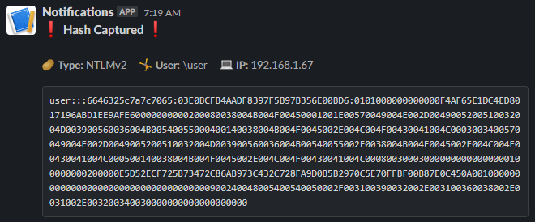

# ResponderSlack

Send a Slack webhook when new Responder hashes are gathered.



## Description

This project allows pentesters to automatically receive a Slack webhook whenever a new hash is gathered with Responder. This is an especially effective tool when using a drop box for a remote external network. This tool can be configured to send only a notification instead of the full hash if such limitations exist.

## Getting Started

### Dependencies

* Responder (https://github.com/lgandx/Responder)
* Configured Slack App and webhook (https://slack.com/help/articles/115005265063-Incoming-webhooks-for-Slack)
* If utilizing the `sendCsv.py` utility, ensure the Slack app has the correct permissions set (https://api.slack.com/messaging/files/setup)

## Installing

```
git clone https://github.com/m4lwhere/ResponderSlack.git
cd ResponderSlack
pip install -r requirements.txt
vim config.json
```
* Update `config.json` with your Slack webhook URL
* Modify `ResponderDB` in `config.json` if not stored in Kali default of `/usr/share/responder/Responder.db`
* Modify `sendHash` if notification only, and not to send the hash. By default, the full hash will be sent via webhook.

## Executing program
By default, the program will check every 60 seconds if a new hash was added to the database. This can be modified in the `config.json` file. Run the program in either a separate tmux pane or in the background.
```
python3 ./responderSlack.py
```

## Authors

Contributors names and contact info

* [m4lwhere](https://m4lwhere.org) 

## Version History

* 0.1
    * Initial Release

## License

This project is licensed under the Apache License - see the LICENSE.md file for details
